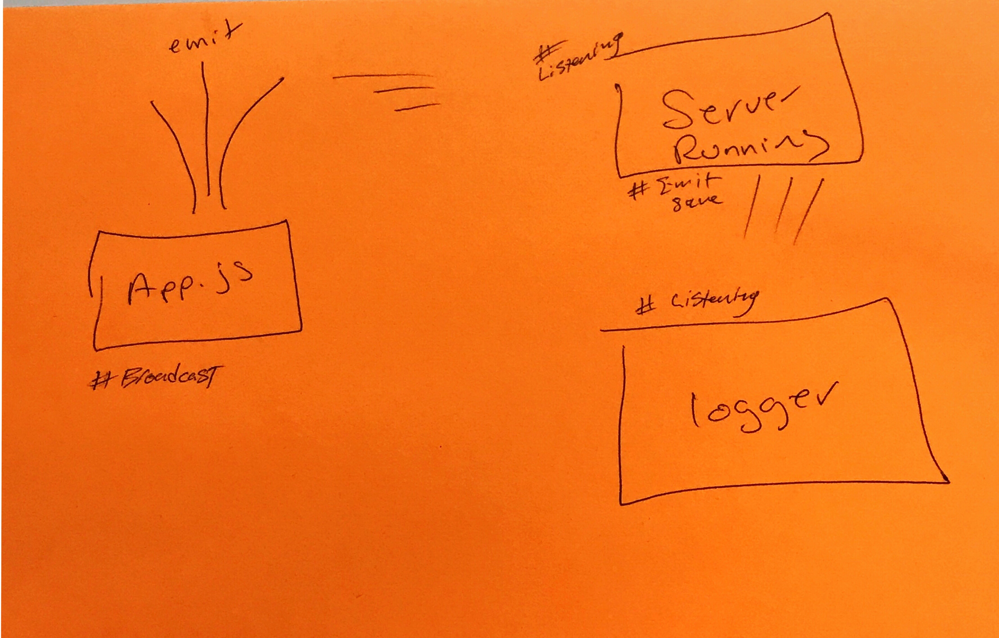

# LAB - 16

### Authors: Jonny and Adriana
* Worked with, and received help from Brad, Brandyn, and Austin for debugging

# Event-Driven Smart App

### Links and Resources
* [submission PR](https://github.com/401-advanced-javascript-jonnygraybill/lab-16/pull/1) 

* [travis]()

#### Documentation
* [jsdoc]() (Does not run due to jsdoc being formatted for an express server)

### Modules
#### events.js
#### logger.js

#### Running the app
* `node app.js test.txt`
  
#### Tests
* npm testing will do the following:
  * Inside the terminal, run the "Running the app" command
  * Expect the result of running the command to be truthy if successful
  * test.txt file content will be saved in uppercase format

### UML

